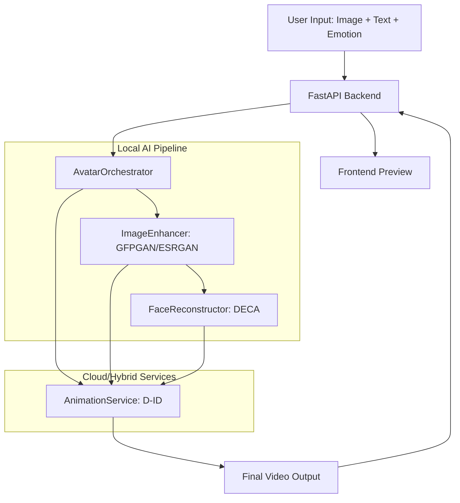

# Architecture Overview: DreamTalk Pro

DreamTalk Pro is a state-of-the-art AI microservice designed to transform static images into highly realistic, emotionally expressive 3D talking avatars. Unlike basic systems, DreamTalk Pro utilizes a local-hybrid pipeline that combines high-performance local AI models with robust cloud APIs.

## The AI Processing Pipeline

The system operates on a 4-stage asynchronous pipeline, optimized for GPU acceleration.

### Stage 1: Identity Preparation & Enhancement
- **Model**: GFPGAN v1.3 + Real-ESRGAN x2plus
- **Process**: 
  - Detects faces in the input image.
  - Performs blind face restoration to fix low-quality or blurry photos.
  - Scales the background and facial textures by 2x using super-resolution.
- **Output**: A clean, high-resolution source image ready for animation.

### Stage 2: 3D Face Reconstruction
- **Model**: DECA (Detailed Expression Capture and Animation)
- **Process**:
  - Extracts 3D geometry from the 2D enhanced image.
  - Generates a Flame-based facial mesh.
  - Separates identity (shape) from expression and pose.
- **Output**: 3D mesh parameters and facial landmark coefficients.

### Stage 3: Lip-Sync & Driver Mapping
- **Model**: D-ID (Cloud) or Wav2Lip (Local)
- **Process**:
  - Synchronizes the generated audio with the enhanced facial textures.
  - Applies driver expressions based on the mapping logic (eyebrows, eyes, mouth).
- **Output**: Raw animated frames or video stream.

### Stage 4: Final Rendering & Post-Processing
- **Process**:
  - Composites the animated face back onto the high-resolution background.
  - Performs final color grading and sharpening.
- **Output**: A production-ready .mp4 file.

## Data Flow Architecture

## System Requirements
- **Compute**: NVIDIA GPU with 8GB+ VRAM (for local inference).
- **Network**: Stable internet connection for Cloud API calls.
- **Storage**: SSD for caching high-resolution outputs and model weights.
